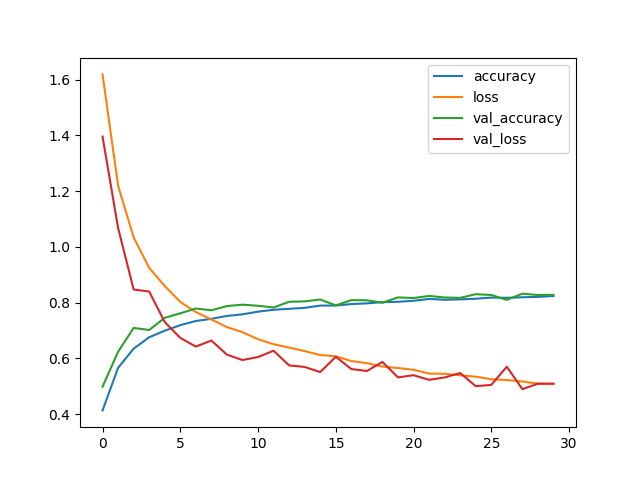
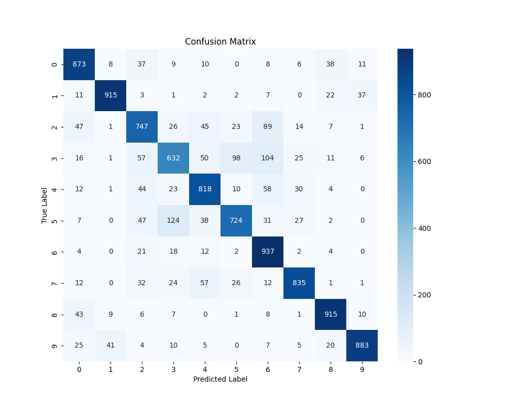

# Image-classification-on-CIFAR-10-using-CNNs-with-Keras-and-TensorFlow
Image classification on CIFAR-10 using CNNs with Keras and TensorFlow
# 🧠 CIFAR-10 Classification with CNN

This project uses a convolutional neural network (CNN) built with Keras and TensorFlow to classify RGB images from the CIFAR-10 dataset into 10 categories.

## 🚀 Run the Notebook

📓 [Click here to view the notebook](cifar10_cnn.ipynb)

☁️ Open in Google Colab:  

## 🧰 Tools & Libraries

- Python 3
- TensorFlow & Keras
- NumPy & Pandas
- Matplotlib & Seaborn
- Scikit-learn

## 🧠 Model Architecture

Input (32x32x3) → Conv2D(32) + ReLU + Dropout + BatchNorm
→ Conv2D(64) + ReLU + MaxPooling + Dropout + BatchNorm
→ Conv2D(64) + ReLU + MaxPooling + Dropout + BatchNorm
→ Conv2D(128) + ReLU + MaxPooling + Dropout + BatchNorm
→ Flatten
→ Dense(32) + ReLU + Dropout + BatchNorm
→ Dense(10) + Softmax

## 📊 Dataset

[CIFAR-10](https://www.cs.toronto.edu/~kriz/cifar.html) contains 60,000 32×32 RGB images in 10 classes:
- Airplane, Automobile, Bird, Cat, Deer, Dog, Frog, Horse, Ship, Truck

---

## 📈 Training Progress

### 📊 Accuracy & Loss

---

### 🔍 Confusion Matrix

---

## 📁 Files

- `cifar10_cnn.ipynb`: Main training notebook
- `CNN_cifar10.keras`: Trained model file
- *(Optional soon)*: `training_plot.png`, `confusion_matrix.png`

---
**Parmida**  
M.Sc. in Data Science | Deep Learning Explorer  
📍 Iran 
